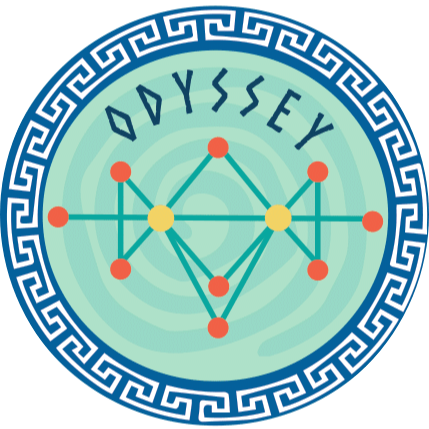

# Odyssey

https://diagnose.shinyapps.io/odyssey/

Please check **Odyssey_Tutorial.pdf** to how to use Odyssey. 

<h4 align="center"> Odyssey: a tool for microRNA-mRNA expression and interaction visualisation </h4>

    <a href="https://github.com/alptaciroglu/Odyssey/commits/master">
    
    <a href="https://github.com/alptaciroglu/Odyssey/issues">
    

---

<table>
<tr>
<td>

* MicroRNAs (miRNAs) are non-coding short RNA molecules that are found in all metazoa studied so far. When distinct metazoa genomes considered up to 200 genes encode for unique miRNAs that show variability between species. Regulatory functions of miRNAs have been studied for 20 years starting after their discovery. The research suggests that they are involved in a wide spectrum of biological activities including apoptosis, tumorigenesis, development, homeostasis and viral infections. miRNAs regulate these cellular processes at the post-transcriptional level by binding to the messenger RNAs (mRNAs), leading to an unstable derivative of the initial biological molecule. miRNA targets are understrict evolutionary pressure which further implicates the importance of underlying biological mechanisms. 

* Although there are several Gene/mRNA-miRNA interaction visualization and analysis tools "Odyssey" was built for improved interactive visualization the interaction network of miRNAs with along with their target expressions for a user uploaded dataset. It is built using Shiny package of the R programming language leading to seamless online access and modularity. In the end, I aim to provide users a user-friendly web-application which consists of modules that allows: uploading of their own data; performing differential expression (DGEx) analysis; and visualization of the network of which "Odyssey" builds from either experimentally validated or predicted interactions for individual miRNAs queried by the user. Odyssey further enables the user to filter selected nodes of the networks using fold change cut-offs obtained in DGEx step or expand the network using Gene Ontology (GO) terms to act as a strong predictor of the phenotype of interest for the user-specified biological data. Furthermore, the application has been demonstrated using two different public miRNA-mRNA expression datasets.

(Preview)

